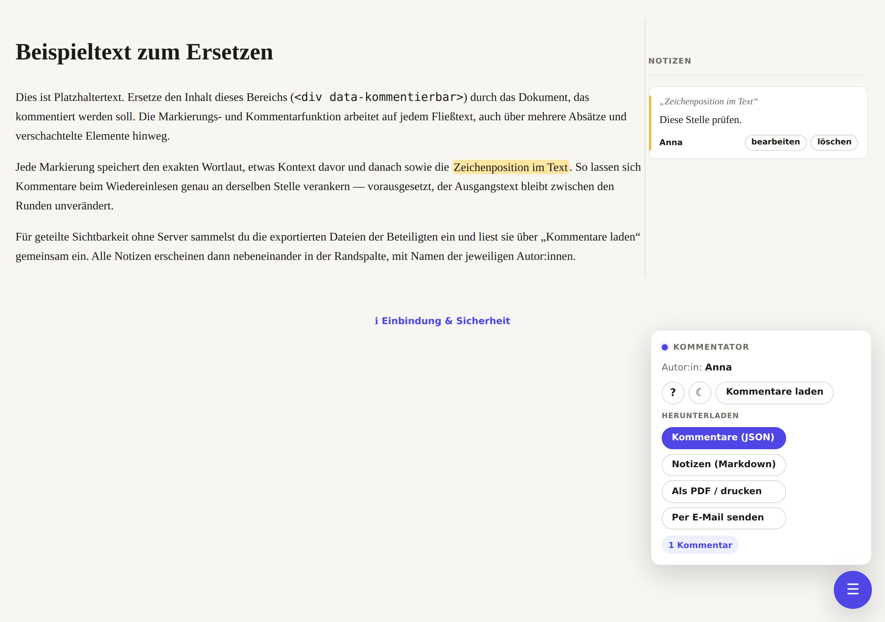

<div align="center">

# 📝 Kommentator

### Textstellen markieren & kommentieren — als einbindbare, statische Dateien

Ein leichtgewichtiges Kommentar-Werkzeug für beliebige Webseiten.
Markieren, kommentieren, als JSON exportieren und mehrere Rückmeldungen
zusammenführen — **ohne Server, ohne Build, ohne externe Abhängigkeiten.**

<br>

[](LICENSE)


<br>

**[▶ Live-Demo](https://daimpad.github.io/kommentator/)**  ·
**[📘 Tutorial](TUTORIAL.md)**  ·
**[🛠 Technische Doku](TECHNISCHE_DOKUMENTATION.md)**

<br>



</div>

<br>

## ✨ Was es kann

- 🖍️ **Markieren & kommentieren** — Textstellen mit Maus oder Touch, auch über
  mehrere Absätze und verschachtelte Elemente hinweg.
- 🔲 **Elemente kommentieren** — nicht nur Text: ganze Boxen, Container und
  Bilder anklicken und kommentieren (W3C `CssSelector`).
- 📍 **Punkte anheften** — an eine genaue Stelle einen Pin setzen
  (Element-relativ verankert, übersteht Reload).
- 🧷 **Präzise Verankerung** — W3C-Web-Annotation-nah; Kommentare finden ihre
  Stelle beim Wiedereinlesen zuverlässig wieder.
- 🔀 **Zusammenführen ohne Backend** — Rückmeldungen exportieren, einsammeln,
  gemeinsam einlesen (dedupliziert nach `id`).
- 🎛️ **Aufgeräumte Oberfläche** — Floating-Button unten rechts, ziehbare
  Notizspalte, „?“-Hilfe, ☾/☀ Hell-/Dunkelmodus.
- 🎨 **Themebar** — alles über CSS-Variablen; Dark-Mode inklusive.
- ♿ **Barrierearm** — Tastaturfokus, ARIA, `prefers-reduced-motion`, responsiv.
- 🧩 **Überall einbindbar** — statische Seite oder WordPress-Plugin.
- 🪶 **Winzig** — zwei Dateien, kein Framework, kein `localStorage`.

## 🚀 Schnellstart

```html
<link rel="stylesheet" href="kommentare.css">

<div data-kommentierbar>
  … dein Fließtext …
</div>

<script src="kommentare.js"></script>
<script>
  Kommentare.init({
    container: '[data-kommentierbar]',
    autor: 'Vorname Nachname',
    toolbarMode: 'floating',
    themeToggle: true
  });
</script>
```

Das war alles — Randspalte und Menü entstehen automatisch. Ausführlich im
**[Tutorial](TUTORIAL.md)**.

## 📦 Einsatzwege

| Weg | Kurz |
|---|---|
| **Statische Seite** | `kommentare.css` + `kommentare.js` einbinden, `init(...)` aufrufen |
| **WordPress** | Plugin aus `wordpress/kommentare-tool/` installieren → siehe [Tutorial](TUTORIAL.md#5-in-wordpress-installieren) |
| **GitHub Pages** | Dateien pushen, Pages auf `main`/root → [Tutorial](TUTORIAL.md#6-veröffentlichen-auf-github-pages) |

## 🔒 Kurz zur Sicherheit

Das Namensfeld dient der **Zuordnung**, nicht dem Zugriffsschutz. Echten Schutz
(„Name + Passwort“) regelt der Betrieb serverseitig — z. B. HTTP Basic Auth
(`.htaccess`) oder WordPress-Login. Details im
[Tutorial](TUTORIAL.md#7-echten-zugriffsschutz-einrichten).

## 📚 Dokumentation

- **[Tutorial](TUTORIAL.md)** — Nutzung, Installation, Deployment, Troubleshooting.
- **[Technische Dokumentation](TECHNISCHE_DOKUMENTATION.md)** — API, Optionen,
  Datenmodell, Theming, WordPress-Filter, Tests.
- **[CLAUDE.md](CLAUDE.md)** — Leitfaden für Beiträge / KI-Agenten.

## 🧪 Tests

```bash
npm install
npx playwright install chromium
npm test
```

## 📄 Lizenz

[MIT](LICENSE) © 2026 Damian Paderta.
