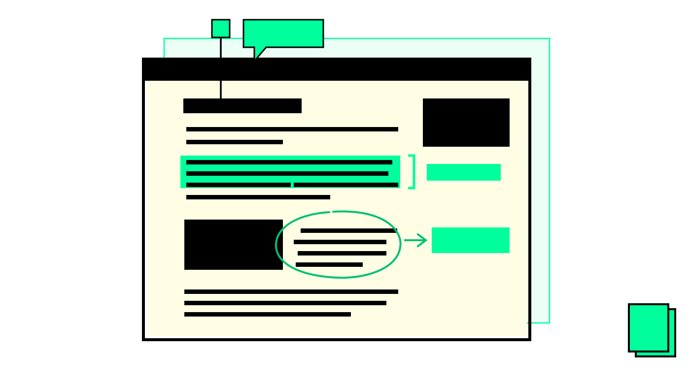

<div align="center">



# Kommentator

### Textstellen markieren und kommentieren — als einbindbare, statische Dateien

Gute digitale Dienste.

<br>


<br>

**[Live-Demo](https://daimpad.github.io/kommentator/)** ·
**[WordPress-Plugin](../../releases)** ·
**[Überblick](UEBERBLICK.md)** ·
**[Tutorial](TUTORIAL.md)** ·
**[Technische Doku](TECHNISCHE_DOKUMENTATION.md)**

<br>


</div>

---

## Worum es geht

Rückmeldungen zu einer Webseite kommen sonst als E-Mail-Fließtext („die
Überschrift auf der zweiten Seite unten…"), als Word-Datei mit Screenshots oder
als Telefonnotiz — und müssen erst wieder auf der Seite gesucht werden.

Der Kommentator legt sich als Klebezettel-Schicht über die bestehende Seite:
Textstellen markieren, Elemente anklicken, Punkte anheften — jeweils mit einem
Kommentar daran, ohne an der Seite selbst etwas zu ändern. Die Rückmeldung
entsteht dort, wo sie hingehört.

Andere lösen das mit Figma-Kommentaren, Usersnap oder Marker.io. Die können mehr
und verlangen dafür Konto, Abo, fremden Server und Datenschutzprüfung. Hier sind
es zwei Dateien, die man neben die Seite legt.

> **Für wen?** Agenturen in Abnahmerunden · Redaktionen beim Gegenlesen ·
> alle mit Datenschutzauflagen (kein Konto, keine Cookies, kein Tracking,
> keine IP-Adressen) · WordPress-Betreiber:innen · Entwickler:innen, die so
> etwas einbauen wollen.
>
> Ausführlich: **[Überblick](UEBERBLICK.md)** — was er ist, was er kann, wofür
> er taugt, wofür ausdrücklich nicht, und wer sich damit befassen sollte.

---

## Was es kann

| | |
|---|---|
| **Markieren und kommentieren** | Textstellen mit Maus oder Touch, auch über mehrere Absätze und verschachtelte Elemente hinweg |
| **Elemente kommentieren** | nicht nur Text: ganze Boxen, Container und Bilder anklicken (W3C `CssSelector`) |
| **Punkte anheften** | an eine genaue Stelle einen Pin setzen, Element-relativ verankert |
| **Ganze Seite oder Randspalte** | Notizen in einer Spalte *oder* schwebend — dann ist die komplette Seite kommentierbar, ohne das Layout umzubauen |
| **Präzise Verankerung** | W3C-Web-Annotation-nah; Kommentare finden ihre Stelle beim Wiedereinlesen wieder |
| **Zusammenführen ohne Server** | exportieren, einsammeln, gemeinsam einlesen — dedupliziert nach `id` |
| **Alles in einer Tabelle** | optional: neue Kommentare melden sich an ein Google Sheet oder einen eigenen Endpunkt. Ohne Adresse verlässt nichts den Browser |
| **Aufgeräumte Oberfläche** | ein Knopf unten rechts, ziehbare Notizspalte, Kurzanleitung, Hell- und Dunkelmodus |
| **Themebar** | alles über CSS-Variablen; die Demo trägt ein anderes Erscheinungsbild als das Werkzeug |
| **Barrierearm** | Tastaturfokus mit Fokusfalle in Dialogen, ARIA, `prefers-reduced-motion`, bis 380 px |
| **Überall einbindbar** | statische Seite oder WordPress-Plugin; das Plugin bringt eine Einstellungsseite mit |
| **Winzig** | zwei Dateien, kein Framework, kein `localStorage` |

---

## Schnellstart

```html
<link rel="stylesheet" href="kommentare.css">

<div data-kommentierbar>
  … dein Fließtext …
</div>

<script src="kommentare.js"></script>
<script>
  Kommentare.init({
    container: '[data-kommentierbar]',
    autor: 'Vorname Nachname',
    toolbarMode: 'floating',
    themeToggle: true
  });
</script>
```

Das war alles — Randspalte und Menü entstehen automatisch. Ausführlich im
**[Tutorial](TUTORIAL.md)**.

---

## Einsatzwege

| Weg | Kurz |
|---|---|
| **Statische Seite** | `kommentare.css` + `kommentare.js` einbinden, `init(...)` aufrufen |
| **WordPress** | Plugin-ZIP aus den [Releases](../../releases) (Tag `wp-v*`) hochladen → [Tutorial](TUTORIAL.md#5-in-wordpress-installieren) |
| **GitHub Pages** | Dateien pushen, Pages auf `main`/root → [Tutorial](TUTORIAL.md#6-veröffentlichen-auf-github-pages) |
| **Eigener Server** | Git-Klon im Webroot, `deploy.php` zieht ihn per GitHub-Webhook nach → [Tutorial](TUTORIAL.md#6-veröffentlichen-auf-github-pages) |

Die [Demo-Seite](https://daimpad.github.io/kommentator/) trägt das
[nozilla-Erscheinungsbild](https://github.com/daimpad/nozilla-ci) — umgesetzt
allein über `demo.css` und die CSS-Variablen des Werkzeugs. `kommentare.css`
bleibt dabei unverändert und neutral: dasselbe Werkzeug nimmt jedes andere
Erscheinungsbild genauso an.

---

## Kurz zur Sicherheit

**Das Namensfeld ordnet zu, es schützt nicht.** Echten Schutz („Name +
Passwort") regelt der Betrieb serverseitig — HTTP Basic Auth (`.htaccess`) oder
WordPress-Login. Details im
[Tutorial](TUTORIAL.md#7-echten-zugriffsschutz-einrichten).

**Ohne Konfiguration verlässt nichts den Browser.** Kein `localStorage`, keine
Cookies, kein Tracking, keine externen Anfragen.

**Mit Sammelstelle:** Die Adresse muss den Browser erreichen. In WordPress lädt
er sie erst nach der Anmeldung über einen eigenen Endpunkt nach — im
ausgelieferten HTML stehen weder Adresse noch Klarname. Bei statischer
Einbindung steht sie im Quelltext; dagegen hilft das Geheimwort, das die
Gegenstelle prüft. Zusätzlich in den Plugin-Einstellungen „Im Frontend nur
angemeldete Nutzer:innen" gesetzt lassen (ab Werk an). Gemeldet wird nie eine
IP-Adresse, sondern eine anonyme Sitzungskennung, die beim Schließen des Tabs
verfällt; ist die Sammelstelle aktiv, benennt der Hilfetext den Versand.

---

## Dokumentation

- **[Überblick](UEBERBLICK.md)** — was der Kommentator ist, wofür er taugt,
  wofür nicht, und für wen er gedacht ist.
- **[Tutorial](TUTORIAL.md)** — Nutzung, Installation, Deployment,
  Problembehebung.
- **[Kommentare in einem Google Sheet sammeln](TUTORIAL.md#8-kommentare-in-einem-google-sheet-sammeln)**
  — Schritt für Schritt, mit fertigem Apps-Script.
- **[Technische Dokumentation](TECHNISCHE_DOKUMENTATION.md)** — API, Optionen,
  Datenmodell, Theming, WordPress-Filter, Tests.
- **[CLAUDE.md](CLAUDE.md)** — Leitfaden für Beiträge und KI-Agenten.

---

## Tests

```bash
npm install
npx playwright install chromium
npm test              # Werkzeug (Playwright) + Plugin-Logik (PHP)
```

138 Akzeptanz-Checks im Browser, 70 Prüfungen der WordPress-Plugin-Logik gegen
eine Attrappe — beides ohne Installation lauffähig.

---

## Lizenz

[MIT](LICENSE) © 2026 Damian Paderta.
