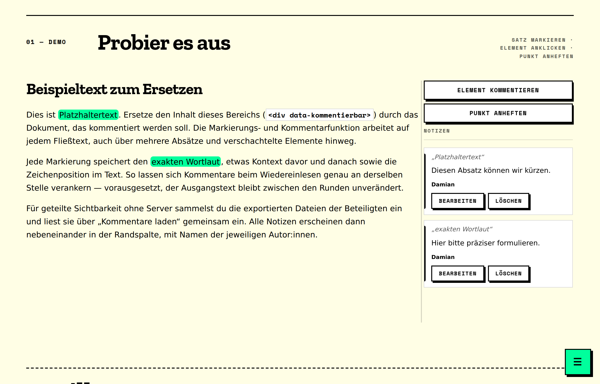

<div align="center">

# 📝 Kommentator

### Textstellen markieren & kommentieren — als einbindbare, statische Dateien

Ein leichtgewichtiges Kommentar-Werkzeug für beliebige Webseiten.
Markieren, kommentieren, als JSON exportieren und mehrere Rückmeldungen
zusammenführen — **ohne Server, ohne Build, ohne externe Abhängigkeiten.**

<br>

[](LICENSE)


<br>

**[▶ Live-Demo](https://daimpad.github.io/kommentator/)**  ·
**[⬇ WordPress-Plugin](../../releases)**  ·
**[💡 Überblick](UEBERBLICK.md)**  ·
**[📘 Tutorial](TUTORIAL.md)**  ·
**[🛠 Technische Doku](TECHNISCHE_DOKUMENTATION.md)**

<br>



</div>

<br>

## 💡 Worum es geht

Rückmeldungen zu einer Webseite kommen sonst als E-Mail-Fließtext („die
Überschrift auf der zweiten Seite unten…"), als Word-Datei mit Screenshots oder
als Telefonnotiz — und müssen erst wieder auf der Seite gesucht werden.

Der Kommentator legt sich als **Klebezettel-Schicht über die bestehende Seite**:
Textstellen markieren, Elemente anklicken, Punkte anheften — jeweils mit einem
Kommentar daran, ohne an der Seite selbst etwas zu ändern. Die Rückmeldung
entsteht dort, wo sie hingehört.

Andere lösen das mit Figma-Kommentaren, Usersnap oder Marker.io: leistungsfähig,
aber gebunden an Konto, Abo, fremden Server und Datenschutzprüfung. Hier sind es
**zwei Dateien, die man neben die Seite legt.**

> **Für wen?** Agenturen in Abnahmerunden · Redaktionen beim Gegenlesen ·
> alle mit Datenschutzauflagen (kein Konto, keine Cookies, kein Tracking,
> keine IP-Adressen) · WordPress-Betreiber:innen · Entwickler:innen, die so
> etwas einbauen wollen.
>
> **Ausführlich: [→ Überblick](UEBERBLICK.md)** — was er ist, was er kann,
> wofür er taugt, wofür ausdrücklich nicht, und wer sich damit befassen sollte.

## ✨ Was es kann

- 🖍️ **Markieren & kommentieren** — Textstellen mit Maus oder Touch, auch über
  mehrere Absätze und verschachtelte Elemente hinweg.
- 🔲 **Elemente kommentieren** — nicht nur Text: ganze Boxen, Container und
  Bilder anklicken und kommentieren (W3C `CssSelector`).
- 📍 **Punkte anheften** — an eine genaue Stelle einen Pin setzen
  (Element-relativ verankert, übersteht Reload).
- 🪟 **Ganze Seite oder Randspalte** — Notizen als in-flow-Spalte *oder*
  schwebend (`notes: 'floating'`), dann ist die komplette Seite inkl.
  Header/Footer kommentierbar, ohne das Layout umzubauen.
- 🧷 **Präzise Verankerung** — W3C-Web-Annotation-nah; Kommentare finden ihre
  Stelle beim Wiedereinlesen zuverlässig wieder.
- 🔀 **Zusammenführen ohne Backend** — Rückmeldungen exportieren, einsammeln,
  gemeinsam einlesen (dedupliziert nach `id`).
- 📊 **Optional: alles in einer Tabelle** — mit `webhook` melden sich neue
  Kommentare automatisch an ein **Google Sheet** (Apps Script) oder einen
  eigenen Endpunkt. Viele Kommentierende, viele Seiten, **eine** Tabelle —
  ohne Datenbank. Ohne die Adresse verlässt nichts den Browser.
- 🎛️ **Aufgeräumte Oberfläche** — Floating-Button unten rechts, ziehbare
  Notizspalte, „?“-Hilfe, ☾/☀ Hell-/Dunkelmodus.
- 🎨 **Themebar** — alles über CSS-Variablen; Dark-Mode inklusive.
- ♿ **Barrierearm** — Tastaturfokus mit Fokusfalle in Dialogen, ARIA,
  `prefers-reduced-motion`, responsiv bis 380 px.
- 🧩 **Überall einbindbar** — statische Seite oder WordPress-Plugin; das Plugin
  bringt eine **Einstellungsseite** mit, `functions.php` ist optional.
- 🪶 **Winzig** — zwei Dateien, kein Framework, kein `localStorage`.

## 🚀 Schnellstart

```html
<link rel="stylesheet" href="kommentare.css">

<div data-kommentierbar>
  … dein Fließtext …
</div>

<script src="kommentare.js"></script>
<script>
  Kommentare.init({
    container: '[data-kommentierbar]',
    autor: 'Vorname Nachname',
    toolbarMode: 'floating',
    themeToggle: true
  });
</script>
```

Das war alles — Randspalte und Menü entstehen automatisch. Ausführlich im
**[Tutorial](TUTORIAL.md)**.

## 📦 Einsatzwege

| Weg | Kurz |
|---|---|
| **Statische Seite** | `kommentare.css` + `kommentare.js` einbinden, `init(...)` aufrufen |
| **WordPress** | Fertiges Plugin-ZIP aus den [Releases](../../releases) (Tag `wp-v*`) hochladen → siehe [Tutorial](TUTORIAL.md#5-in-wordpress-installieren) |
| **GitHub Pages** | Dateien pushen, Pages auf `main`/root → [Tutorial](TUTORIAL.md#6-veröffentlichen-auf-github-pages) |

## 🔒 Kurz zur Sicherheit

**Das Namensfeld ordnet zu, es schützt nicht.** Echten Schutz („Name +
Passwort") regelt der Betrieb serverseitig — HTTP Basic Auth (`.htaccess`) oder
WordPress-Login. Details im
[Tutorial](TUTORIAL.md#7-echten-zugriffsschutz-einrichten).

**Ohne Konfiguration verlässt nichts den Browser.** Kein `localStorage`, keine
Cookies, kein Tracking, keine externen Anfragen.

**Mit Sammelstelle:** Die Adresse steht im Seitenquelltext — das lässt sich bei
einem Client-Werkzeug nicht ändern. Wer sie kennt, kann in die Tabelle
schreiben. Auf öffentlichen Seiten deshalb in den Plugin-Einstellungen
**„Im Frontend nur angemeldete Nutzer:innen"** setzen (statisch:
`kommentare_should_load` bzw. Auslieferung hinter Login). Gemeldet wird nie eine
IP-Adresse, sondern eine anonyme Sitzungskennung, die beim Schließen des Tabs
verfällt; ist die Sammelstelle aktiv, benennt der „?"-Hilfetext den Versand.

## 📚 Dokumentation

- **[Überblick](UEBERBLICK.md)** — was der Kommentator ist, wofür er taugt,
  wofür nicht, und für wen er gedacht ist.
- **[Tutorial](TUTORIAL.md)** — Nutzung, Installation, Deployment, Troubleshooting.
- **[Kommentare in einem Google Sheet sammeln](TUTORIAL.md#8-kommentare-in-einem-google-sheet-sammeln)**
  — Schritt für Schritt, mit fertigem Apps-Script.
- **[Technische Dokumentation](TECHNISCHE_DOKUMENTATION.md)** — API, Optionen,
  Datenmodell, Theming, WordPress-Filter, Tests.
- **[CLAUDE.md](CLAUDE.md)** — Leitfaden für Beiträge / KI-Agenten.

## 🧪 Tests

```bash
npm install
npx playwright install chromium
npm test              # Werkzeug (Playwright) + Plugin-Logik (PHP)
```

116 Akzeptanz-Checks im Browser, 27 Prüfungen der WordPress-Plugin-Logik gegen
eine Attrappe — beides ohne Installation lauffähig.

## 📄 Lizenz

[MIT](LICENSE) © 2026 Damian Paderta.
